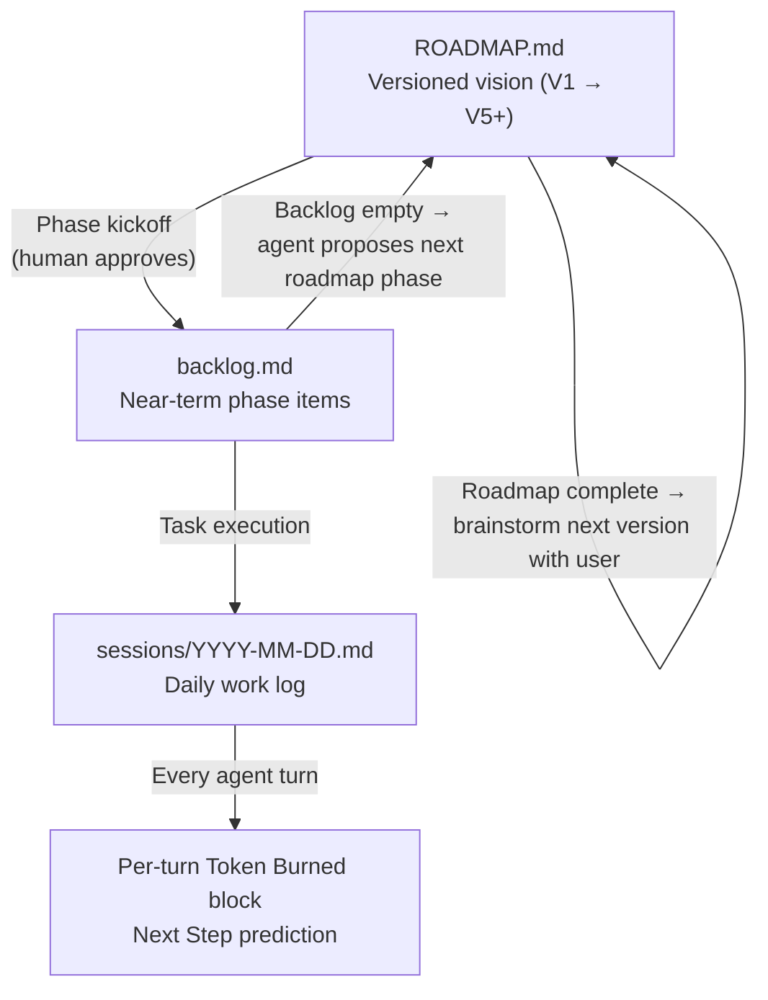

# Context

Project-specific background, design philosophy, and non-obvious constraints.

## Product Design Philosophy

id: ml-20260430-004
created: 2026-04-30
updated: 2026-05-05
scope: project
type: context
tags: [design, tokens, memory-quality, writing]
confidence: high
status: active
source: manual

### Summary
Memory is curation, routing, retrieval, and lifecycle — not a chat dump. Token efficiency is the primary design constraint.

### Details
- MindLayer is prompt-first in V1. The installer makes the system one-pass usable by creating predictable files, adapters, indexes, and ignored local directories.
- Initialization must distinguish structural presence from semantic value. Scaffold files with no real content must not be loaded as useful context.
- Token efficiency is the primary design constraint. Everything an agent needs for durable context lives in MindLayer markdowns.
- Memory entries should be short, explicit, and written for AI retrieval with minimal ambiguity and token waste. Clarity wins over jargon.
- Do not duplicate memory across tool-specific adapter files; they drift.
- A memory file that exists but is not indexed is effectively unavailable. Index entries are the discoverability contract.
- Installer changes require sandbox test coverage: fresh install, idempotent rerun, file preservation, and adapter block integrity.

### When to use
Use when deciding whether an implementation detail improves memory quality or merely adds machinery. Use when writing or editing memory entries, templates, prompts, and command instructions.

### Related
ml-20260430-003

## Goal Hierarchy and Flow

id: ml-20260505-004
created: 2026-05-05
updated: 2026-05-05
scope: project
type: context
tags: [goal-hierarchy, roadmap, backlog, next-step, flow, token-burned]
confidence: high
status: active
source: manual

### Summary
MindLayer uses a three-level goal hierarchy: roadmap (versioned vision) → backlog (near-term tasks) → sessions (daily work). The per-turn Token Burned block surfaces Next Step by walking this hierarchy bottom-up.

### Flow Diagram

### Next Step Prediction Hierarchy

The agent always predicts the smallest useful next action by walking up:

1. **Active task** → next action within the current task
2. **Task complete** → next item in backlog
3. **Backlog empty** → surface next roadmap phase for human approval to pull
4. **Roadmap complete** → propose brainstorming next major version with the user

### Backlog Pull

When the agent surfaces a roadmap phase pull and the user says 'pull next phase', decompose the phase into discrete backlog items and propose each for approval before writing.

### When to use
Use when implementing or evaluating Next Step prediction, backlog pull behavior, roadmap-to-backlog decomposition, and per-turn Token Burned block logic.

### Related
ml-20260430-005
ml-20260505-003
